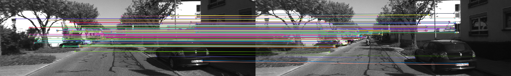
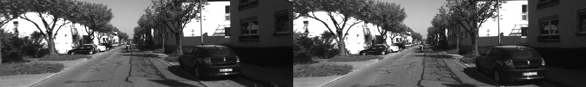
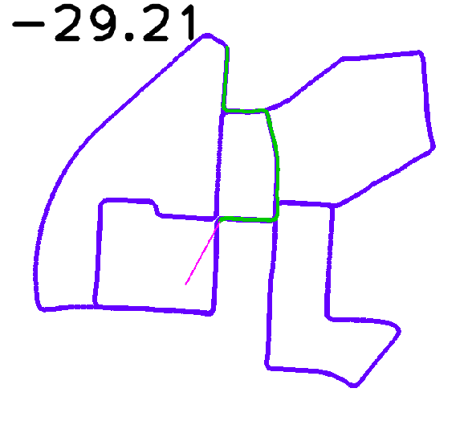

# CAFTP (Cool Acronym For The Project)

Project for Signal Image and Video, UniTN

<div style="text-align:center;">



</div>

## About
The goal of the project is to build a Monocular Visual Odometry system from scratch, without the assistance of machine learning or neural networks, relaying only traditional computer vision tecniques. 
The main objective is to construct a robust system that can be used on different kinds of cameras by providing an easy to use pipeline that goes from calibration to exploration.

<br>
<div style="text-align:center;">

</div>
<br>

## General Information

The project is entirely built in python and, while for many tasks we relayed on third party libraries such as OpenCV, we made sure to implements as many components as possible from scratch, deep diving into the logic that goes behind a full VO system. For our benchmarks we used [KITTI](https://www.cvlibs.net/datasets/kitti/) as well as clips recorded by the team.

### Project Structure

```


├── calibration
│   ├── camera_calibration_charuco.py
│   └── camera_calibration_normal.py
├── camera_data
│   ├── board.png
│   ├── calib.json
│   └── ...
├── data                                # datasets and videos
│   ├── data_odometry_gray              # KITTI sequences
│   │   └── dataset
│   │       └── sequences
│   │           ├── 00
│   │           │   ├── image_0
│   │           │   ├── image_1
│   │           │   ├── calib.txt
│   │           │   └── times.txt
│   │           └──...
│   ├── data_odometry_poses             # KITTI poses for sequences
│   │   └── dataset
│   │       └── poses
│   │           ├── 00.txt
│   │           └──  ...
│   └──  ...
├── tests
│   ├── __init__.py
│   ├── build_graphs.ipynb
│   ├── compare_results.py
│   ├── test_runs.py
│   └── test_runs_video.py
├── images
│   └── ...
├── __init__.py
├── common.py
├── evaluation.py
├── kitti_loader.py
├── position.py
├── setup.py
├── VOAgent.py
├── vo.py
├── README.md
└── requirements.txt

```


## Usage

install requirements

```
pip install -r requirements.txt
```

### With KITTI
Download and extract <a href=https://www.cvlibs.net/datasets/kitti/eval_odometry.php>KITTI visual odometry</a> datasets in the <i>data</i> folder

The full 22GB dataset with all 22 sequences is aviable at this link: <a href=https://www.cvlibs.net/datasets/kitti/user_login.php>KITTI image data</a>. 

A lighter 225MB version containig only sequence 22 is available at this link on <a href="https://drive.google.com/drive/folders/1lh0QLIo15Rr3JK6u5jNcgM2uX-k4pOK9?usp=sharing">Google Drive</a>.

```
data/data_odometry_gray
```
Run vo.py in kitti mode (default)

```
python vo.py -m kitti
```

You can provide the desired <i>sequence</i> index to be run 

```
python vo.py -m kitti -s 2
```

### With videos

To run in video mode a camera calibration file must be provieded. The camera calibration file can be obtained using <i>camera_calibration_charuco.py</i> and the ChAruCo pattern inside the camera_data folder

```
python vo.py -m video -cp {calib/file/path.json} -vp {video/path.mp4}
```


### General Controls

To the script can be provided the number of frames to analyze (default -1 means the entire length)

```
python vo.py -m kitti -s 2 -st 100
```
As well as the feature matching method used as combinations of SIFT, ORB and either bruteforce or FLANN plus some more

```
python vo.py -m kitti -s 2 -fm 2
```

And the amount of scaling to apply to the images

```
python vo.py -m kitti -sf 0.5
```
Use <i>-h</i> for a comprehensive list of options

```
options:
  -h, --help            show this help message and exit
  -m , --mode           Set the input mode for VO. ['video'|'kitti']
  -s , --sequence       Index of KITTI sequence [kitti mode]
  -st , --steps         Number of frames to analyse. -1 for all frames.
  -f , --frameskip      Set the frequency of frames to analyse
  -o , --output         Output folder for the results
  -nd, --no-debug       Do not show debug windows
  -fm , --feat-match    Set the feature matching method. [0|1|2|3|4|5](see common.py) 
  -nf , --num-feat      Set the number of features to detect in each frame. [video mode]
  -cp , --calib-path    Path to the calibration file. [video mode]
  -vp , --video-path    Path to the video file. [video mode]
  -ki , --kitti-imgs    Path to the data_odometry_gray folder. [kitti mode]
  -kp , --kitti-poses   Path to the data_odometry_poses folder. [kitti mode]
  -sf , --scale-factor  Amount of scaling to apply to the images
  -de , --denoise       Amount (size of kernel) of gaussian blur to apply to the images for denoising. Default 0
  -ms , --map-size      Size of map
```

## Calibration

In order to calibrate the camera you can use the provided scripts <i>camera_calibration_charuco.py</i> and <i>camera_calibration_normal.py</i>. It's <i>highly recommended</i> to use the ChArUco script for calibration with the provided board image in the <i>camera_data</i> folder.

To calibrate the camera using the ChArUco board you must first record a video of the board from different angles making sure to cover the entire camera frame.

After that execute the script priding the path to the video as well as the output path for the calibration file

```
camera_calibration_charuco.py -v {video/path.mp4} -O {output/file/path.json}
```


## TODO 

- add some default test data
- loop closure
- comparative testing sys
- <strike>parametrize script</strike>
- implementation of error function 
- <strike>pre-processing (downsampling and denoising)</strike>
- report
- provide instructions for camera calibration


## Authors 

- [@lorenzoorsingher](https://github.com/lorenzoorsingher)
- [@iiics](https://github.com/iiics)